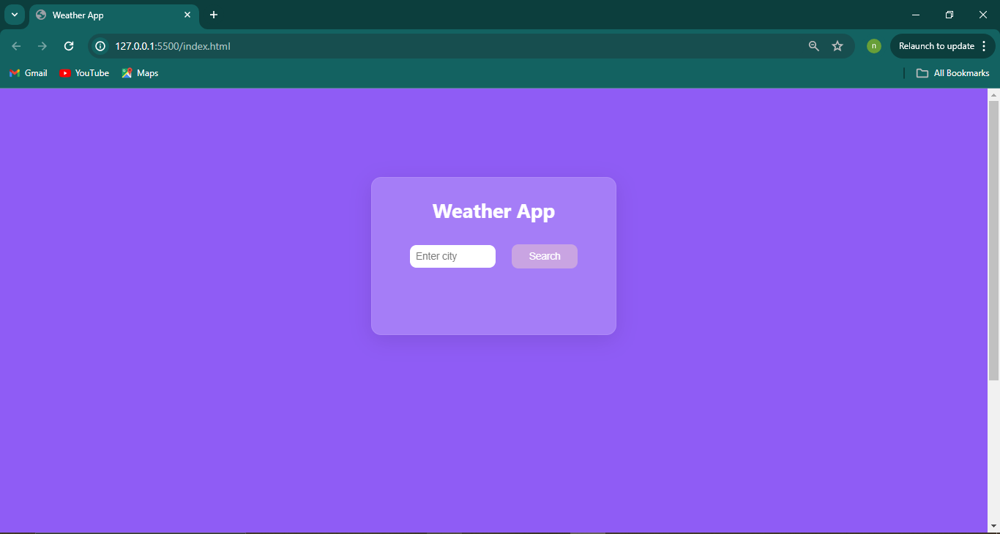
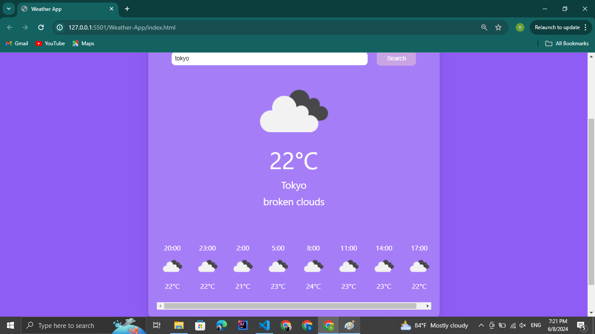

# Weather App  

This is a simple weather application built using HTML, CSS, and JavaScript. It fetches and displays the current weather conditions and the 24-hour weather forecast for a specified city using the OpenWeatherMap API.

## Features 

- Fetches and displays current weather conditions including temperature and weather description.
- Shows an icon representing the current weather condition.
- Provides a 24-hour weather forecast, updated every 3 hours.
- Responsive design for use on both desktop and mobile devices.

## Screenshots :camera: 

**Before entering a city**

**Displaying Weather conditions of the specified city**

## Demo :movie_camera:

Check out the demo video below to see the Weather App in action:

https://private-user-images.githubusercontent.com/154311325/337948023-a4dd4388-9d88-42b3-91c5-bd84caf3b745.mp4?jwt=eyJhbGciOiJIUzI1NiIsInR5cCI6IkpXVCJ9.eyJpc3MiOiJnaXRodWIuY29tIiwiYXVkIjoicmF3LmdpdGh1YnVzZXJjb250ZW50LmNvbSIsImtleSI6ImtleTUiLCJleHAiOjE3MTc5MDg2MzcsIm5iZiI6MTcxNzkwODMzNywicGF0aCI6Ii8xNTQzMTEzMjUvMzM3OTQ4MDIzLWE0ZGQ0Mzg4LTlkODgtNDJiMy05MWM1LWJkODRjYWYzYjc0NS5tcDQ_WC1BbXotQWxnb3JpdGhtPUFXUzQtSE1BQy1TSEEyNTYmWC1BbXotQ3JlZGVudGlhbD1BS0lBVkNPRFlMU0E1M1BRSzRaQSUyRjIwMjQwNjA5JTJGdXMtZWFzdC0xJTJGczMlMkZhd3M0X3JlcXVlc3QmWC1BbXotRGF0ZT0yMDI0MDYwOVQwNDQ1MzdaJlgtQW16LUV4cGlyZXM9MzAwJlgtQW16LVNpZ25hdHVyZT0yYTIwNDIxNmExNjFkZmM1MjVkNjBiNDI3NjExYmZmNWE3NzlkNWI2MmI1YzdhYzc2NjZiYThjMTQ2ZjhhYjFjJlgtQW16LVNpZ25lZEhlYWRlcnM9aG9zdCZhY3Rvcl9pZD0wJmtleV9pZD0wJnJlcG9faWQ9MCJ9.ZP_WDZc1Pomnqr7JSYkQ-xLYv-p2GuVevGkiimj0RUQ

## Getting Started :rocket:

To get a local copy up and running, follow these simple steps. 

### Follow these steps :point_down::point_down::point_down:

1. :dancers: Clone the repo to your local machine
2. :globe_with_meridians: Go to https://openweathermap.org
3. :free: Create a free account
4. :key: Navigate to the API keys section
5. :wrench: Generate a key
6. :clipboard: Copy that key to clipboard
7. :open_file_folder: Insert that key into the required variable in the index.js file
8. :tada: Enjoy!

## Acknowledgements

This project relies on the following external resources:

- **OpenWeatherMap API**: Used to fetch weather data for the specified city. [OpenWeatherMap](https://openweathermap.org/)
- **Icons**: Weather icons used in the app are provided by OpenWeatherMap. [OpenWeatherMap Icons](https://openweathermap.org/weather-conditions)
